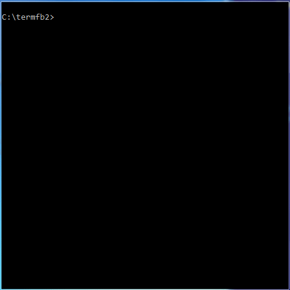

# Termfb2
Простой консольный просмотрщик файлов FB2. Поддерживается далеко не весь набор возможностей FB2, но зато нет необходимости запускать графическую оболочку, чтобы почитать книгу.
Пример приложения, работающего в портабельном режиме и измененными цветами текста и фона:

# Возможности и ограничения

## Возможности
* Самостоятельное приложение, не требующего внешних библиотек
* Открывает как обычные FB2, так и упакованные в zip - нет необходимости в предварительной распаковке
* Всегда (независимо от того, используется библиотека или нет) восстанавливает последнюю открытую книгу на месте, где чтение было прервано
* Опциональная возможность: ведение библиотеки ранее открытых книг. В библиотеку записываются следующие данные о книге: автор, название, серия, язык, жанр, дата добавления(первого открытия), дата завершения(дата, когда первый раз книга была закрыта на 100% прочтено), путь к файлу и позиция, на которой книга была закрыта в последний раз. Путь к файл может быть как полным (если открытая книга была за пределами папки, в которой находится исполняемый файл), так и относительным(это делает библиотеку и программу полностью портабельной)
* Фильтрация в списке книг. Начните набирать и фильтр применится автоматически. Нет необходимости выбирать колонку для фильтра, так как набранный текст ищется сразу во всех колонках
* Конфигурационный файл (в самой программе нет диалога настроек) - программа никогда не пишет в этот файл, поэтому его можно редактировать как угодно и всё сохранится. По умолчанию файл отсутствует, просто скопируйте termfb2.conf.example как termfb.conf в нужную папку(зависит от того, портабельный режим или нет). Формат файла настроек прост: все, что начинается с # - это комментарий, остальные в формате **имяПараметра=значение**, пустые строки пропускаются
* По умолчанию портабельный режим отключён. Чтобы включить его создайте пустой (или скопируйте существующий termfb2.conf.exe) termfb2.conf в папке рядом с исполняемым файлом перед первым запуском
* Два режима отображения текста: с рваным правым краем и с выключкой. По умолчанию - рваные края. Пример как влияет настройка можно взглянуть тут: 
* При промотке текста на экран вниз/вверх просмотрщик отставляет последнюю/первую строку текущего экрана, чтобы не терять нить повествования
* В библиотеке колонки отображают сокращённый текст, чтобы прочесть полный установите курсор на нужную ячейку

## Ограничения
* Поддерживаются только файлы в кодировке UTF-8
* Нет дополнительной подсветки другими цветами важных мест, только 2 цвета используется: для текста и фона. И хотя просмотрщик понимает тэги **strong** и **emphasis**, он отображает такой текст как обычный
* Нет поддержки сносок. Просмотрщик отображает только первый блок **body** из файла, а сноски обычно идут вторым блоком
* Нет поиска при чтении книги
* Неполноценная поддержка изменения размера консоли: все диалоги меняют размер корректно, но книга не переформатируется под новую ширину - книгу приходится переоткрывать
* Может некорректно работать при небольших размерах консоли: минимальная высота около 30 строк, ширина 50-60 колонок

# Аргументы командной строки
На данный момент поддерживается только один параметр: имя файла. Если исполняемый файл запускается без параметров, то открывается книга, прописанная в файл **last**. Если имя файла задано, то для восстановления последней позиции чтения сначала проверяется файл **last**, если в нём записана другая книга, то имя файл ищется в библиотеке. Если файл нигде не найден, то файл открывается с самого начала

# Горячие клавиши
## Глобальные
* CtrlQ + CtrlQ - закрыть приложение. Информация об открытой книге записывается в **last** и базу данных, если она разрешена
## Диалог чтения книги
* "Стрелка вниз" или J - сдвинуть на строку вниз
* "Стрелка вверх" или K - сдвинуть на строку вверх
* Page Up или U - предыдущая страница
* Пробел или Page Down или D - следующая страница
* F2 - открыть библиотеку (если она не запрещена)
## Диалог "Библиотека"
* Escape - закрыть библиотеку и вернутся к чтению книги
* Enter - открыть выбранную книгу для чтения
* F4 - сортировать книги по выбранной колонке (режим меняется циклически после нажатия F4: по возрастанию, по убывания, отключить сортировку по столбцу - в заголовке столбца есть индикатор текущего режима). Если сортировка отключена, то используется та, что по умолчанию: по автору, заголовку и серии
* Любой печатный символ - динамическая фильтрация, текущий фильтр отображается в заголовке диалога
* Backspace - удалить последний символ из текущего значения фильтра

# Известные проблемы
* Книга не открывается - просмотрщик отображает только '--- THE END ---'. Проверьте, что книга в UTF-8 кодировке. Проблема замечена на книгах с кодировкой 'windows-1252'
* Просмотрщик открывает книгу/библиотеку, отображает корректную информацию в заголовке окна(%, автор, заголовок), но само окно не отображает никакого текста. Попробуйте увеличить высоту или ширину консоли (при 20 строках в высоту проблема есть с самим просмотрщиком, при 30 строках просмотрщик работает нормально, но библиотека не отображает список книг, при 40 строках - работает всё), ширина в 50-60 колонок должна быть достаточной

# Файлы используемые программой
Важно: если приложение работает в портабельном режиме, то все файлы создаются в папке с исполняемым файлом, в противном случае все файлы создаются в папке пользователя.
* Директория ".rionnag" - все дополнительные файлы создаются тут
* файл **.rionnag/last** - хранит информацию о последней открытой книге. Создаётся даже если библиотека отключена, что помогает каждый раз читать с последнего места остановки во всех режимах работы просмотрщика
* поддиректория **.rionnag/book.db/books/** - база данных открытых ранее книг, по файлу на книгу. Если базу данных отключить в конфигурационном файле перед первым запуском, то директория не создаётся
* файл конфигурации (отсутствует по умолчанию и программой не создаётся, только читается, можно скопировать termfb2.conf.example) **.rionnag/termfb2.conf**. Доступно 4 опции:
- **useDb** - использовать базу данных. По умолчанию включено(useDb=1). Установите в 0, чтобы отключить
- **textColor** - цвет текста в просмотрщике книги (не влияет на диалог со список книг). Значени по умолчанию 'default', что значит 'использовать цвет заданный в текущей теме'. Восемь цветов на выбор: black, yellow, red, green, blue, magenta, cyan, и white. Дополнительно цвет можно сделать более ярким, что увеличивает количество цветов до 16: допишите 'bold' или 'bright' (без разницы, до имени цвета или после). Примеры корректных значений: "textColor=red", "textColor=while bright", "textColor="bold red", "textColor=green+bright"
- **backColor** - цвет фона просмотрщика. Дополнительную информацию читайте выше в описании параметра **textColor**
- **justify** - управление выключкой текста. По умолчанию выключка отключена
